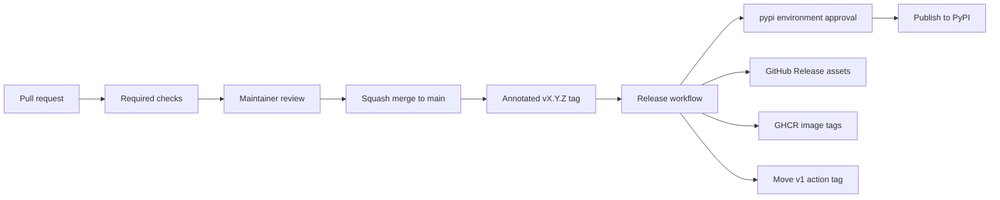

# Release process

This document describes how `surface-audit` releases are managed across
PyPI, GitHub Releases, GHCR, and the reusable GitHub Action.

## Version identifiers

`surface-audit` uses two related but different versioning surfaces:

- **Package release tags** such as `v1.0.2` are immutable release
  markers for the Python package, GitHub Release assets, SBOMs,
  signatures, and GHCR image tags.
- **Major action tags** such as `v1` are moving compatibility tags for
  the reusable GitHub Action. `v1` points to the latest compatible
  `1.x` release, not specifically to `v1.0.0`.

For example, after `v1.0.2` was released, both `v1.0.2` and `v1` point
to the same release commit. Users can choose:

```yaml
# Gets compatible bug fixes on the 1.x line automatically.
uses: dev-ugurkontel/surface-audit@v1

# Pins the exact action release for maximum reproducibility.
uses: dev-ugurkontel/surface-audit@v1.0.2
```

This follows GitHub's documented action-maintenance guidance: create
semantic version tags such as `v1.1.3` and keep major tags such as `v1`
current with the latest compatible release.

## Channels

Each tagged release publishes four surfaces:

- **PyPI**: the canonical Python package installed by `pip`, `pipx`, or
  Python environments.
- **GitHub Releases**: wheel, sdist, CycloneDX SBOM, and Sigstore
  bundles.
- **GHCR**: container tags for `latest`, major, major/minor, and exact
  version, for example `latest`, `1`, `1.0`, and `1.0.2`.
- **GitHub Action**: the repository root `action.yml`, consumed through
  `uses: dev-ugurkontel/surface-audit@...`.

GitHub Packages may show the GHCR image after the first successful
container release. PyPI packages do not appear in GitHub's Packages
panel because PyPI is a separate registry.

## Release flow



## Required checks and approvals

Changes to `main` go through a pull request. The branch rules require:

- one approving review
- code owner review
- required status checks for Python 3.10, 3.11, 3.12, 3.13, and build
  distribution
- linear history and squash merges

The `pypi` environment requires maintainer approval before the PyPI
publish job can proceed. This is intentional. GitHub Actions cannot
approve pull request reviews in this repository, and auto-merge is
disabled.

## Release steps

1. Update `pyproject.toml` with the new version.
2. Add the release notes to `CHANGELOG.md`.
3. Open a pull request and wait for CI, Pages, and CodeQL checks.
4. Merge with squash after review.
5. Create and push the exact release tag, replacing `vX.Y.Z` with the
   version being released:

   ```bash
   git tag -a vX.Y.Z -m "vX.Y.Z"
   git push origin vX.Y.Z
   ```

6. Approve the `pypi` environment deployment when the release workflow
   pauses.
7. Confirm the release workflow completed successfully.
8. Confirm PyPI, GitHub Release assets, GHCR tags, and the major action
   tag.

The release workflow updates the major action tag automatically:

```bash
git tag -fa v1 -m "Update v1 to vX.Y.Z" "$GITHUB_SHA"
git push origin refs/tags/v1 --force
```

Force-updating `v1` is expected because it is a moving compatibility
tag. Exact tags such as `v1.0.2` should only be moved to recover from a
failed release before users depend on it; normal releases should create
a new exact tag.

## Failure recovery

If the release workflow fails after an exact tag has been pushed:

1. Inspect the failing job logs.
2. Fix the release workflow or packaging issue on `main` through a pull
   request.
3. Re-point the exact tag only if the failed release did not complete
   successfully.
4. Re-run the tag-triggered workflow by pushing the corrected tag.
5. Delete or cancel failed historical runs when GitHub permissions allow
   it.

Never upload files manually to PyPI or GHCR unless automation is fully
blocked and the manual action is documented in `CHANGELOG.md`.

## Post-release checklist

- `gh release view vX.Y.Z` lists wheel, sdist, SBOM, and Sigstore JSON
  files.
- PyPI reports the new version.
- GHCR exposes `latest`, major, major/minor, and exact version tags.
- `git rev-parse v1^{commit}` matches `git rev-parse vX.Y.Z^{commit}`.
- `gh run list --limit 10` shows no current failed release run.
- The local tree is clean after `make clean`.
